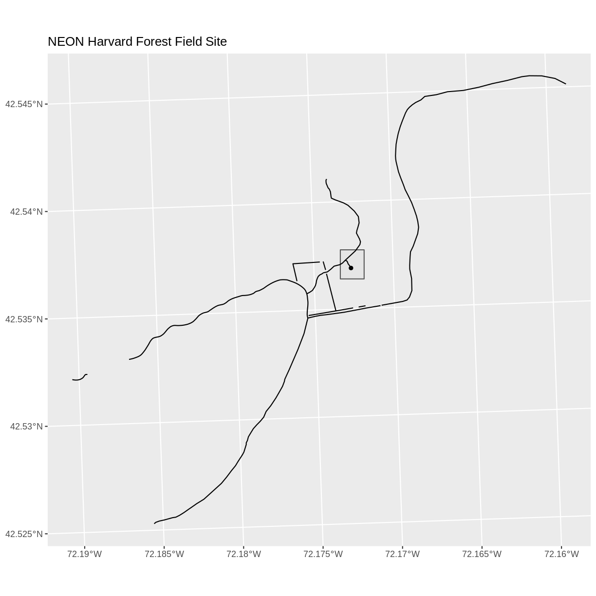
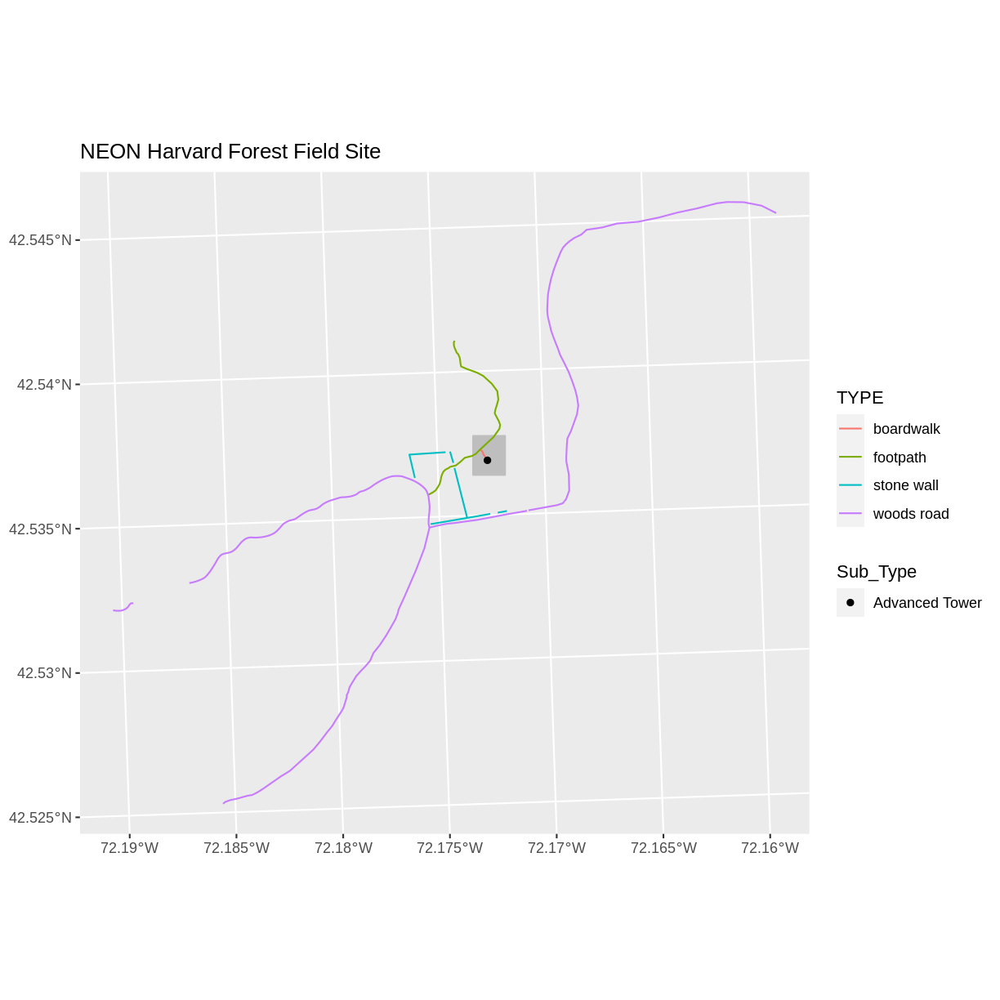
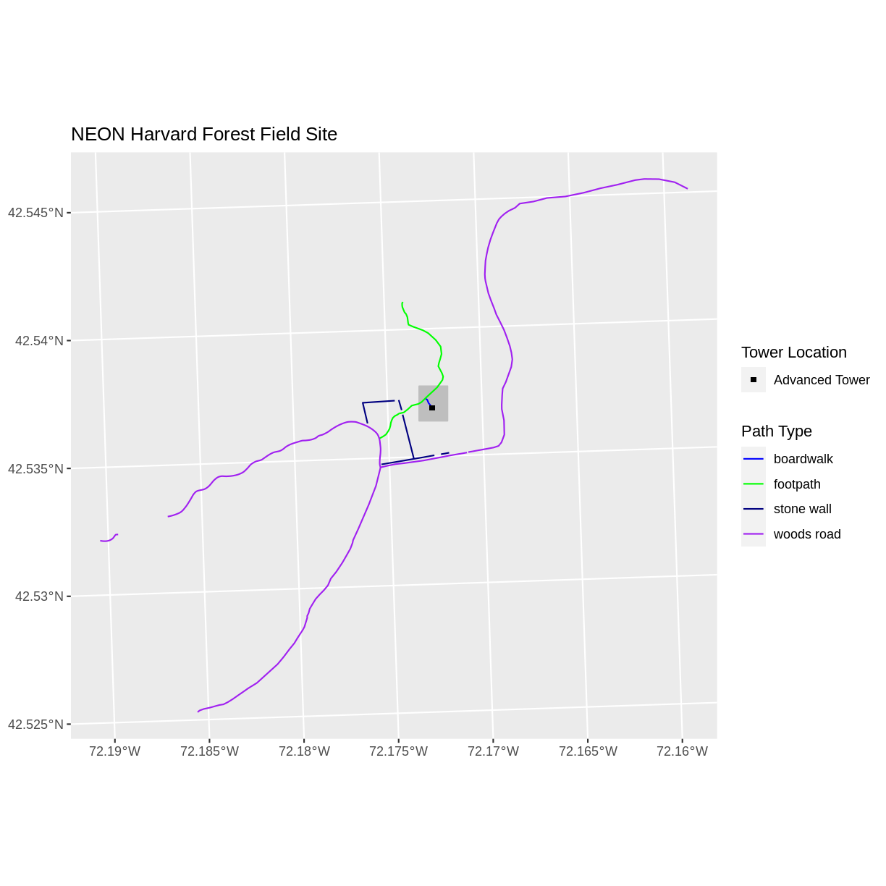
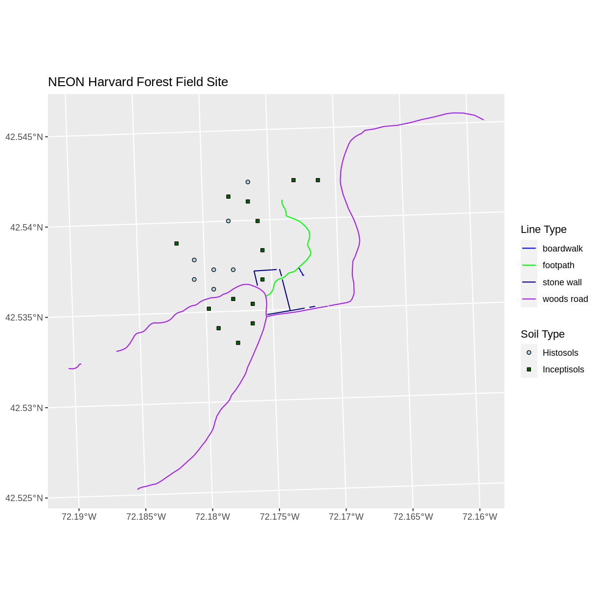
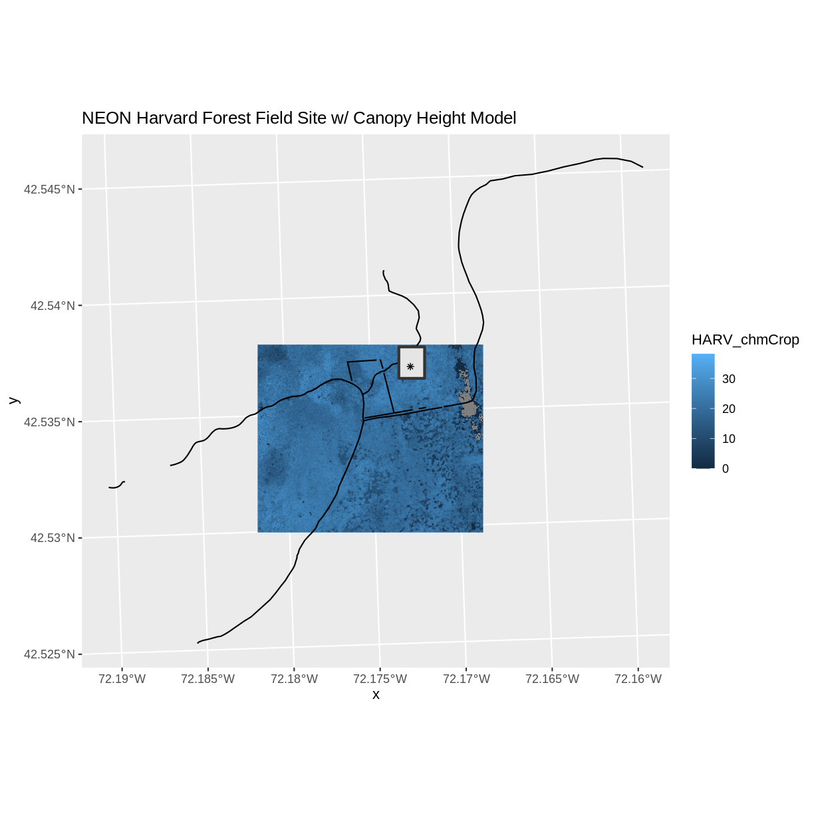

---
# Please do not edit this file directly; it is auto generated.
# Instead, please edit 08-vector-plot-shapefiles-custom-legend.md in _episodes_rmd/
title: "Plot Multiple Shapefiles in R"
teaching: 40
exercises: 20
questions:
- "How can I create map compositions with custom legends using ggplot?"
- "How can I plot raster and vector data together?"
objectives:
- "Plot multiple shapefiles in the same plot."
- "Apply custom symbols to spatial objects in a plot."
- "Create a multi-layered plot with raster and vector data."
keypoints:
- "Use the `+` operator to add multiple layers to a ggplot."
- "Multi-layered plots can combine raster and vector datasets."
- "Use the `show.legend` argument to set legend symbol types."
- "Use the `scale_fill_manual()` function to set legend colors."
source: Rmd
---

> ## Things You’ll Need To Complete This Episode
>
> See the [lesson homepage]({{ site.baseurl }}) for detailed information about the software,
> data, and other prerequisites you will need to work through the examples in this episode.
{: .prereq}

This episode builds upon
[the previous episode]({{ site.baseurl }}/07-vector-shapefile-attributes-in-r/)
to work with shapefile attributes in R and explores how to plot multiple
shapefiles. It also covers how to plot raster and vector data together
on the same plot.

## Load the Data

To work with vector data in R, we can use the `sf` library. The `raster`
package also allows us to explore metadata using similar commands for both
raster and vector files. Make sure that you have these packages loaded.

We will continue to work with the three shapefiles that we loaded in the
[Open and Plot Shapefiles in R]({{site.baseurl}}/06-vector-open-shapefile-in-r/) episode. The three shapefiles are:

- `aoi_boundary_HARV` layer of the "data/vector/HarClip_UTMZ18.shp"
- `lines_HARV` layer of the "data/vector/HARV_roads.shp"
- `point_HARV` layer of the "data/vector/HARVtower_UTM18N.shp"

## Plotting Multiple Shapefiles
In the [previous episode]({{ site.baseurl }}/07-vector-shapefile-attributes-in-r/),
we learned how to plot information from a single shapefile and do
some plot customization including adding a custom legend. However,
what if we want to create a more complex plot with many shapefiles
and unique symbols that need to be represented clearly in a legend?

Now, let's create a plot that combines our tower location (`point_HARV`),
site boundary (`aoi_boundary_HARV`) and roads (`lines_HARV`) spatial objects. We
will need to build a custom legend as well.

To begin, we will create a plot with the site boundary as the first layer. Then layer
the tower location and road data on top using `+`.

~~~
ggplot() + 
  geom_sf(data = aoi_boundary_HARV) +
  geom_sf(data = lines_HARV) +
  geom_sf(data = point_HARV) +
  ggtitle("NEON Harvard Forest Field Site") + 
  coord_sf()
~~~
{: .language-r}

Now that we have a basic plot, we can customize it by changing the symbology, or the look of the data by changing the `fill` and the `color`. We will change the `aoi_boundary_HARV` to be solid gray. Because we want to show the different types of paths at this site, we will also have the color of the `lines_HARV` data be set according to the `TYPE` attribute. Doing this will also create a legend for our plot. And finally, because we also want to includ tower location in the legend, we will have the fill of the `point_HARV` data be set according to the `Sub_type` attribute. 

~~~
ggplot() + 
  geom_sf(data = aoi_boundary_HARV, fill = "grey", color = "grey") +
  geom_sf(data = lines_HARV, aes(color = TYPE)) +
  geom_sf(data = point_HARV, aes(fill = Sub_Type)) +
  ggtitle("NEON Harvard Forest Field Site") + 
  coord_sf()
~~~
{: .language-r}

Next, let's build a custom legend using the symbology (the colors and symbols) that we used to create the plot above. We will use `ggplot2` functions to specify the symbology and change the names of the legends. We will add lines for the `color` or the lines and the `fill` of the points. We will also adjust the legend titles by passing a `name` to the respective `color` and `fill` palettes. 

~~~
ggplot() + 
  geom_sf(data = aoi_boundary_HARV, color = "gray", fill = "grey") +
  geom_sf(data = lines_HARV, aes(color = TYPE)) +
  geom_sf(data = point_HARV, aes(fill = Sub_Type), color = "black") +
  scale_color_manual(values = road_colors, name = "Path Type") +
  scale_fill_manual(values = "black", name = "Tower Location") +
  ggtitle("NEON Harvard Forest Field Site") + 
  coord_sf()
~~~
{: .language-r}

Finally, it might be better if the points were symbolized as a symbol. We can customize this using `shape` parameters in our call to `geom_sf`: 16 is a point symbol, 15 is a box.

> ## Data Tip
> To view a short list of `shape` symbols,
> type `?pch` into the R console.
{: .callout}

~~~
ggplot() + 
  geom_sf(data = aoi_boundary_HARV, color = "gray", fill = "grey") +
  geom_sf(data = lines_HARV, aes(color = TYPE)) +
  geom_sf(data = point_HARV, aes(fill = Sub_Type), color = "black", shape = 15) +
  scale_color_manual(values = road_colors, name = "Path Type") +
  scale_fill_manual(values = "black", name = "Tower Location") +
  ggtitle("NEON Harvard Forest Field Site") + 
  coord_sf()
~~~
{: .language-r}

> ## Challenge: Plot Polygon by Attribute
> 
> 1. Using the `PlotLocations_HARV.shp` shapefile,
> create a map of study plot locations, with each point colored by the soil type
> (`soilTypeOr`). How many different soil types are there at this particular field
> site? Overlay this layer on top of the `lines_HARV` layer (the roads). Create a
> custom legend that applies line symbols to lines and point symbols to the points.
> 
> 2. Modify the plot above. Tell R to plot each point, using a different
symbol of `shape` value.
> 
> > ## Answers
> >
> > If the CHM data are not already loaded from previous episodes,
> > load the raster and convert to a data frame. You will need the `raster` package to do this.
> > 
> > library(raster)
> > CHM_HARV <- raster("data/raster/HARV_chmCrop.tif")
> > CHM_HARV_df <- as.data.frame(CHM_HARV, xy = TRUE)
> > First we need to read in the data and see how many
> > unique soils are represented in the `soilTypeOr` attribute.
> >
> > 
> > ~~~
> > plot_locations <- st_read("data/vector/PlotLocations_HARV.shp")
> > ~~~
> > {: .language-r}
> > 
> > 
> > 
> > ~~~
> > Reading layer `PlotLocations_HARV' from data source `/home/travis/build/UW-Madison-DataScience/r-raster-vector-geospatial/_episodes_rmd/data/vector/PlotLocations_HARV.shp' using driver `ESRI Shapefile'
> > Simple feature collection with 21 features and 25 fields
> > geometry type:  POINT
> > dimension:      XY
> > bbox:           xmin: 731405.3 ymin: 4712845 xmax: 732275.3 ymax: 4713846
> > CRS:            32618
> > ~~~
> > {: .output}
> > 
> > 
> > 
> > ~~~
> > unique(plot_locations$soilTypeOr)
> > ~~~
> > {: .language-r}
> > 
> > 
> > 
> > ~~~
> > [1] "Inceptisols" "Histosols"  
> > ~~~
> > {: .output}
> >
> > Next we can create a new color palette with one color for
> > each soil type.
> >
> > 
> > ~~~
> > blue_green <- c("lightblue", "darkgreen")
> > ~~~
> > {: .language-r}
> >
> > Finally, we will create our plot.
> >
> > 
> > ~~~
> > ggplot() + 
> >   geom_sf(data = lines_HARV, aes(color = TYPE)) + 
> >   geom_sf(data = plot_locations, aes(fill = soilTypeOr), shape = 21) + 
> >   scale_color_manual(name = "Line Type", values = road_colors) + 
> >   scale_fill_manual(name = "Soil Type", values = blue_green) + 
> >   ggtitle("NEON Harvard Forest Field Site") + 
> >   coord_sf()
> > ~~~
> > {: .language-r}
> > 
> > 
> >
> > If we want each soil to be shown with a different symbol, we can
> > give multiple values to the `scale_shape_manual()` argument.
> >
> > 
> > ~~~
> > ggplot() + 
> >   geom_sf(data = lines_HARV, aes(color = TYPE)) + 
> >   geom_sf(data = plot_locations, aes(fill = soilTypeOr, shape = soilTypeOr)) + 
> >   scale_color_manual(name = "Line Type", values = road_colors) + 
> >   scale_fill_manual(name = "Soil Type", values = blue_green) +
> >   scale_shape_manual(name = "Soil Type", values = c(21, 22)) +
> >   ggtitle("NEON Harvard Forest Field Site") + 
> >   coord_sf()
> > ~~~
> > {: .language-r}
> > 
> > 
> {: .solution}
{: .challenge}

> ## Challenge: Plot Raster & Vector Data Together
>
> You can plot vector data layered on top of raster data using the 
> `+` to add a layer in `ggplot`. Create a plot that uses the NEON AOI
> Canopy Height Model `HARV_chmCrop.tif`
> as a base layer. On top of the
> CHM, please add:
>
> * The study site AOI
> * Roads
> * The tower location
>
> Be sure to give your plot a meaningful title.
>
> > ## Answers
> >
> > 
> > ~~~
> > ggplot() +
> >   geom_raster(data = CHM_HARV_df, aes(x = x, y = y, fill = HARV_chmCrop)) +
> >   geom_sf(data = lines_HARV, color = "black") +
> >   geom_sf(data = aoi_boundary_HARV, color = "grey20", size = 1) +
> >   geom_sf(data = point_HARV, pch = 8) +
> >   ggtitle("NEON Harvard Forest Field Site w/ Canopy Height Model") + 
> >   coord_sf()
> > ~~~
> > {: .language-r}
> > 
> > 
> {: .solution}
{: .challenge}


